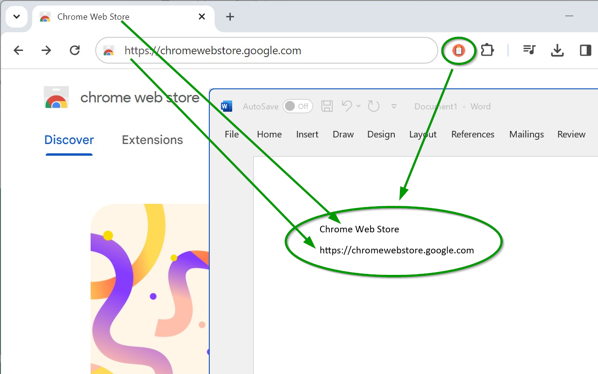

# SendURLToClipboard
This Google Chrome extension adds a button to the toolbar which allows you to copy the webpage URL and title to the clipboard. That's all!

You will find the extension at [Google Chrome Web Store](https://chrome.google.com/webstore/detail/send-url-to-clipboard/kgjhbeocmonphjgjehbncidbckjbhbmi).

